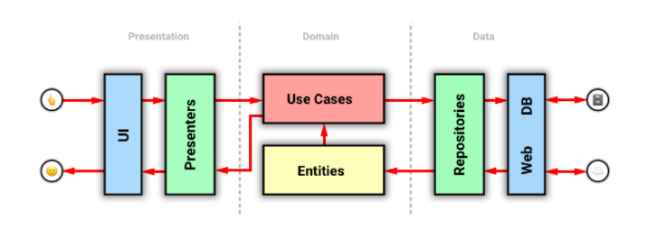

# 🦕 Golephant

## Installation
```bash
# Clone the repository
git clone https://github.com/Almazatun/golephant.git
# Enter into the directory
cd golephant/
# Install the dependencies
go mod download
```

### Starting the application

```bash
# Build and Up
$ docker-compose up --build -d
```
### Domain-Driven Design | Data flow


### UML diagram


