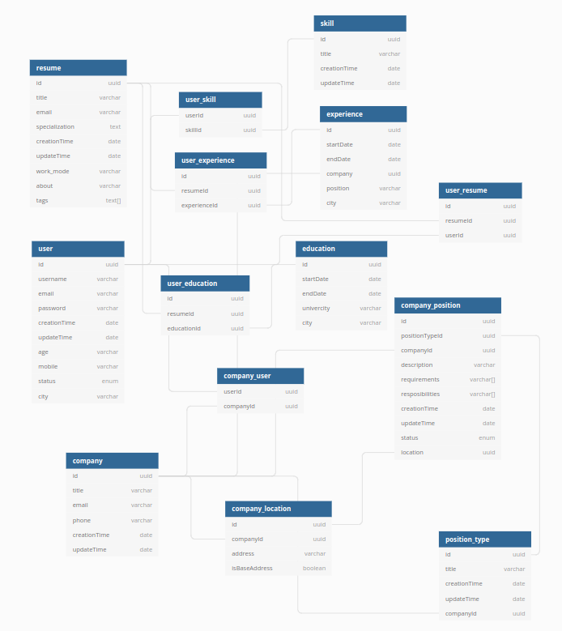

# 🦕 Golephant

## Installation
```bash
# Clone the repository
git clone https://github.com/Almazatun/golephant.git
# Enter into the directory
cd golephant/
# Install the dependencies
go mod download
```

### Starting the application

```bash
# Build and Up
$ docker-compose up --build -d
```
## Endpoints

### User

| Description | http | path |
|:--:|:--:|:--|
| REGISTER | POST | BASE_URL/user/register |
| LOGIN  | PUT | BASE_URL/user/login |
| UPDATE_USER_DATA | PATCH | BASE_URL/user/:userId |
| AUTH_ME | POST | BASE_URL/authMe/:userId |

### Resume

| Description | http | path |
|:--:|:--:|:--|
| CREATE | POST | BASE_URL/resume/user/:userId |
| DELETE  | PUT | BASE_URL/resume/:resumeId|
| BASIC_INFO | PUT | BASE_URL/resume/:resumeId/user/:userId/basicInfo |
| ABOUT_ME | PUT | BASE_URL/resume/:resumeId/user/:userId/aboutMe |
| CITIZENSHIP | PUT | BASE_URL/resume/:resumeId/user/:userId/citizenship |
| DESIRED_POSITION | PUT | BASE_URL/resume/:resumeId/user/:userId/desiredPosition |
| TAGS | PUT | BASE_URL/resume/:resumeId/user/:userId/tags |

### User Education

| Description | http | path |
|:--:|:--:|:--|
| CREATE | PUT | BASE_URL/resume/:resumeId/user/:userId/userEducation |
| DELETE | DELETE | BASE_URL/resume/:resumeId/userEducation/:userEducationId |

### User Experiences

| Description | http | path |
|:--:|:--:|:--|
| CREATE | PUT | BASE_URL/resume/:resumeId/user/:userId/userExperiences |
| DELETE | DELETE | BASE_URL/resume/:resumeId/userExperience/:userExperienceId |
### UML diagram
